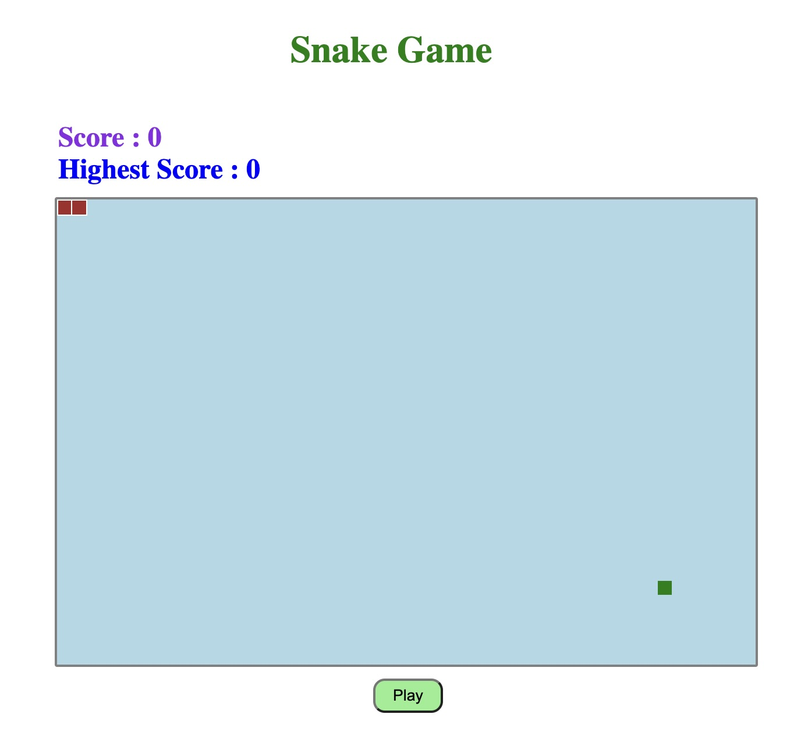
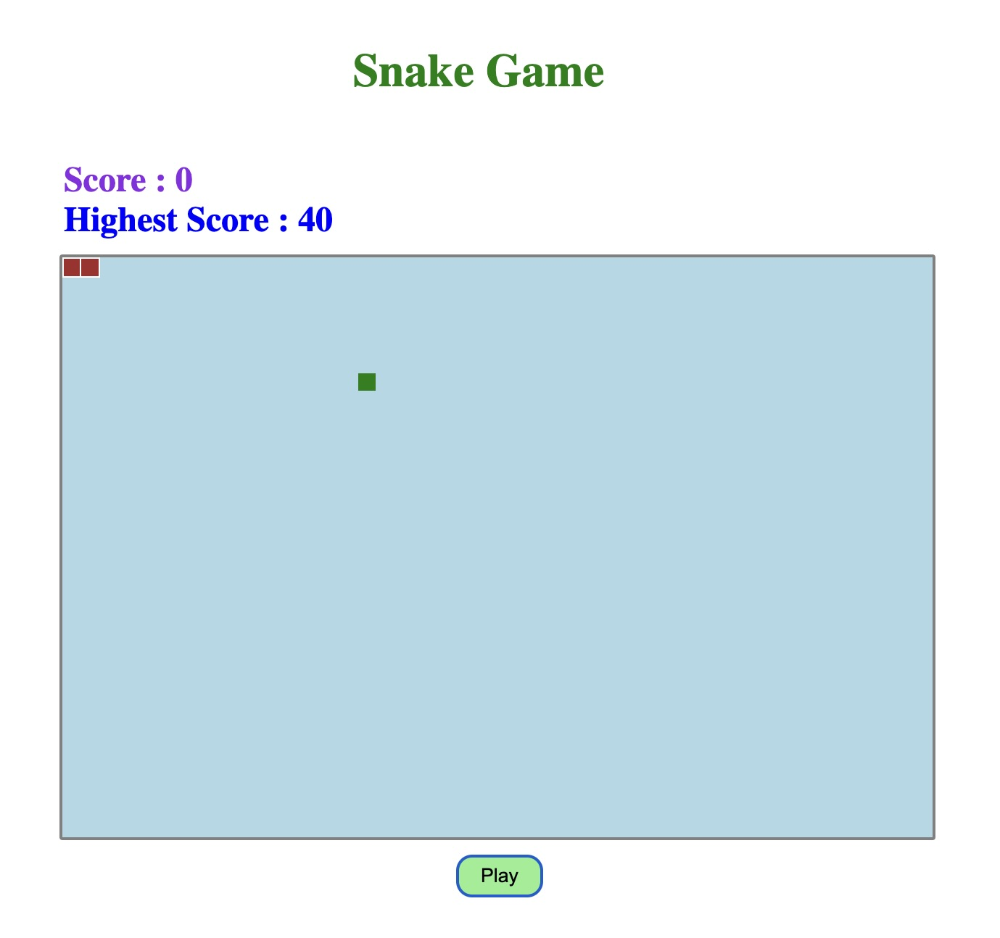

Hi 👋,
Welcome to the React Snake Game repository! This is a fun and interactive Snake game built using ReactJS. Play as long as you can and watch your snake grow with it as well your score!

Features:
1. Very basic setup helps to understand the game easily for a player.
2. Easy on eye colors to play as long as one wish to or can do.
3. Score display just above the board to easily check the score achieved by the user.

This project has been developed with the use of <b>ReactJS library</b> and <b>Vite</b>.

#### React Snake Game App Screenshot

<table>
  <tr>
     <td>Game start page</td>
    <td>Game page after play</td>
  </tr>
  <tr>
    <td></td>
    <td></td>
  </tr>
 </table>
